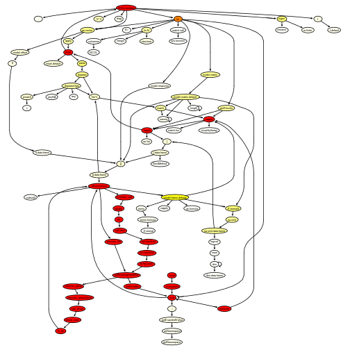
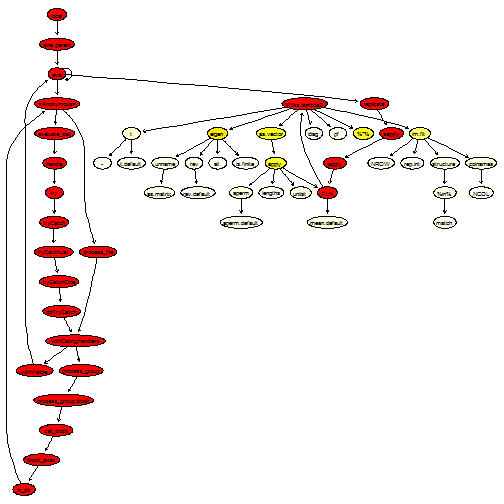
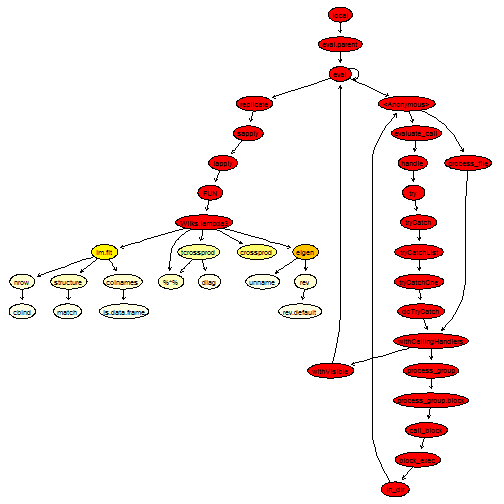
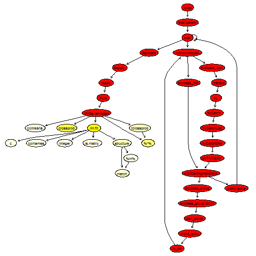
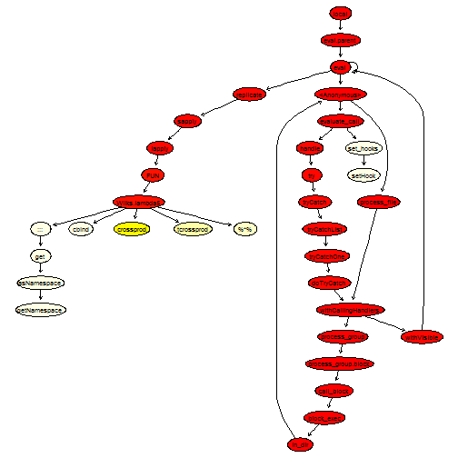
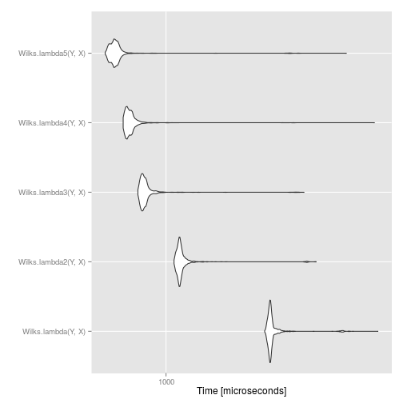

I will give an example of code optimisation in R, using Noam Ross's ```proftable``` function and Luke Tierney's ```proftools``` package, which I discuss in my [tutorial on optimisation](https://www.maxturgeon.ca/blog/2015-09-10-optimisation/). The code we will optimise comes from the main function of our [PCEV package](https://github.com/GreenwoodLab/pcev). A few months ago, while testing the method using simulations, I had to speed up my code because it was way to slow, and the result of this optimisation is given below. 

For background, recall that PCEV is a dimension-reduction technique, akin to PCA, but where the components are obtained by maximising the proportion of variance explained by a set of covariates. For more information, see this [blog post](https://www.maxturgeon.ca/blog/2015-08-06-pcev/). 

<!--more-->

### First version

Below, I have reproduced the first version of the code that I was using:


```r
# Compute PCEV and its p-value 
Wilks.lambda <- function(Y, x) {
  N <- dim(Y)[1]
  p <- dim(Y)[2] 
  bar.Y <- as.vector(apply(Y, 2, mean))
  # Estimte the two variance components
  fit <- lm(Y~x)
  Y.fit <- fit$fitted
  Vr <- t((Y - Y.fit)) %*% Y
  Vg <- (t(Y.fit) %*% Y - N * bar.Y %*% t(bar.Y))
  res <- Y-Y.fit
  # We need to take the square root of Vr
  temp <- eigen(Vr,symmetric=T)
  Ur <- temp$vectors
  diagD <- temp$values 
  value <- 1/sqrt(diagD)
  root.Vr <- Ur %*% diag(value) %*% t(Ur)
  m <- root.Vr %*% Vg %*% root.Vr
  # PCEV and Wilks are eigen-components of m
  temp1 <- eigen(m,symmetric=T)
  PCEV <- root.Vr %*% temp1$vectors
  d <- temp1$values
  # Wilks is an F-test
  wilks.lambda <- ((N-p-1)/p) * d[1]
  df1 <- p
  df2 <- N-p-1
  p.value <- pf(wilks.lambda, df1, df2, lower.tail = FALSE)
  
  return(list("environment" = Vr, 
              "genetic" = Vg, 
              "PCEV"=PCEV, 
              "root.Vr"=root.Vr,
              "values"=d, 
              "p.value"=p.value))
}
```

As we can see, we are using a few common R functions, like ```lm```, matrix multiplication and ```eigen```. Let's see where the bottlenecks are. As mentioned in the [documentation](http://www.hep.by/gnu/r-patched/r-exts/R-exts_71.html#SEC71), we will wrap our code in a call to replicate so that we can accurately investigate the call stack.


```r
set.seed(12345)
Y <- matrix(rnorm(100*20), nrow=100)
X <- rnorm(100)

library(proftools)

Rprof(tmp <- tempfile())
res <- replicate(n = 1000, Wilks.lambda(Y, X), simplify = FALSE)
Rprof()
proftable(tmp)
```


```
##  PctTime
##  11.95  
##   7.55  
##   6.92  
##   4.40  
##   3.14  
##   3.14  
##   3.14  
##   2.52  
##   2.52  
##   2.52  
##  Call                                                                
##  eigen                                                               
##  lm > model.frame.default > .External2 > na.omit > na.omit.data.frame
##  %*%                                                                 
##  lm > lm.fit                                                         
##  as.vector > apply                                                   
##  as.vector > apply > mean.default                                    
##  lm                                                                  
##                                                                      
##  lm > model.frame.default                                            
##  lm > lm.fit > structure                                             
## 
## Parent Call: local > eval.parent > eval > eval > eval > eval > <Anonymous> > process_file > withCallingHandlers > process_group > process_group.block > call_block > block_exec > in_dir > <Anonymous> > evaluate_call > handle > try > tryCatch > tryCatchList > tryCatchOne > doTryCatch > withCallingHandlers > withVisible > eval > eval > replicate > sapply > lapply > FUN > Wilks.lambda > ...
## 
## Total Time: 3.18 seconds
## Percent of run time represented: 47.8 %
```


```r
plotProfileCallGraph(readProfileData(tmp),
                     score = "total")
```

 

Not surprisingly, ```eigen``` is taking up quite some time to run (but note that we are calling it twice). Moreover, ```lm``` is calling several other functions. This is because it tidies up the output. 

### First attempt at optimising

Since we only need the fitted values, we can replace our call to ```lm``` by a call to ```lm.fit```.


```r
# Compute PCEV and its p-value - Take 2
Wilks.lambda2 <- function(Y, x) {
  N <- dim(Y)[1]
  p <- dim(Y)[2] 
  bar.Y <- as.vector(apply(Y, 2, mean))
  # Estimte the two variance components
  fit <- lm.fit(cbind(rep_len(1, N), x), Y)
  Y.fit <- fit$fitted.values
  Vr <- t((Y - Y.fit)) %*% Y
  Vg <- (t(Y.fit) %*% Y - N * bar.Y %*% t(bar.Y))
  res <- Y-Y.fit
  # We need to take the square root of Vr
  temp <- eigen(Vr,symmetric=T)
  Ur <- temp$vectors
  diagD <- temp$values 
  value <- 1/sqrt(diagD)
  root.Vr <- Ur %*% diag(value) %*% t(Ur)
  m <- root.Vr %*% Vg %*% root.Vr
  # PCEV and Wilks are eigen-components of m
  temp1 <- eigen(m,symmetric=T)
  PCEV <- root.Vr %*% temp1$vectors
  d <- temp1$values
  # Wilks is an F-test
  wilks.lambda <- ((N-p-1)/p) * d[1]
  df1 <- p
  df2 <- N-p-1
  p.value <- pf(wilks.lambda, df1, df2, lower.tail = FALSE)
  
  return(list("environment" = Vr, 
              "genetic" = Vg, 
              "PCEV"=PCEV, 
              "root.Vr"=root.Vr,
              "values"=d, 
              "p.value"=p.value))
}
```


```r
Rprof(tmp <- tempfile())
res <- replicate(n = 1000, Wilks.lambda2(Y, X), simplify = FALSE)
Rprof()
proftable(tmp)
```


```
##  PctTime Call                                                  
##  24.10   FUN > Wilks.lambda2 > eigen                           
##  22.89   FUN > Wilks.lambda2 > %*%                             
##   8.43   FUN > Wilks.lambda2 > as.vector > apply               
##   6.02   FUN > Wilks.lambda2 > lm.fit                          
##   3.61   FUN > Wilks.lambda2 > as.vector > apply               
##   3.61   FUN > Wilks.lambda2 > as.vector > apply > mean.default
##   2.41   FUN > Wilks.lambda2 > as.vector > apply > unlist      
##   2.41   FUN > Wilks.lambda2 > lm.fit > colnames               
##   2.41   FUN > Wilks.lambda2 > t                               
##   1.20                                                         
## 
## Parent Call: local > eval.parent > eval > eval > eval > eval > <Anonymous> > process_file > withCallingHandlers > process_group > process_group.block > call_block > block_exec > in_dir > <Anonymous> > evaluate_call > handle > try > tryCatch > tryCatchList > tryCatchOne > doTryCatch > withCallingHandlers > withVisible > eval > eval > replicate > sapply > lapply > ...
## 
## Total Time: 1.66 seconds
## Percent of run time represented: 77.1 %
```


```r
plotProfileCallGraph(readProfileData(tmp),
                     score = "total")
```

 

What we can notice now is that ```as.vector``` is being called quite often. Looking at the source code, we see that we can probably replace ```apply(Y, 2, mean)``` by the optimised function ```colMeans```. Moreover, some of the matrix multiplications involve matrix transposition; for this purpose, it is better to use the optimised functions ```crossprod``` and ```tcrossprod```:


```r
# Compute PCEV and its p-value - Take 3
Wilks.lambda3 <- function(Y, x) {
  N <- dim(Y)[1]
  p <- dim(Y)[2] 
  bar.Y <- colMeans(Y)
  # Estimte the two variance components
  fit <- lm.fit(cbind(rep_len(1, N), x), Y)
  Y.fit <- fit$fitted.values
  res <- Y - Y.fit
  Vr <- crossprod(res, Y)
  Vg <- crossprod(Y.fit, Y) - N * tcrossprod(bar.Y)
  # We need to take the square root of Vr
  temp <- eigen(Vr,symmetric=T)
  Ur <- temp$vectors
  diagD <- temp$values 
  value <- 1/sqrt(diagD)
  root.Vr <- tcrossprod(Ur %*% diag(value), Ur)
  m <- root.Vr %*% Vg %*% root.Vr
  # PCEV and Wilks are eigen-components of m
  temp1 <- eigen(m,symmetric=T)
  PCEV <- root.Vr %*% temp1$vectors
  d <- temp1$values
  # Wilks is an F-test
  wilks.lambda <- ((N-p-1)/p) * d[1]
  df1 <- p
  df2 <- N-p-1
  p.value <- pf(wilks.lambda, df1, df2, lower.tail = FALSE)
  
  return(list("environment" = Vr, 
              "genetic" = Vg, 
              "PCEV"=PCEV, 
              "root.Vr"=root.Vr,
              "values"=d, 
              "p.value"=p.value))
}
```


```r
Rprof(tmp <- tempfile())
res <- replicate(n = 1000, Wilks.lambda3(Y, X), simplify = FALSE)
Rprof()
proftable(tmp)
```


```
##  PctTime Call                     
##  36.73   eigen                    
##  14.29   crossprod                
##  14.29   lm.fit                   
##   4.08   lm.fit > structure       
##   4.08   tcrossprod               
##   4.08   tcrossprod > %*%         
##   2.04                            
##   2.04   %*%                      
##   2.04   eigen > rev              
##   2.04   eigen > rev > rev.default
## 
## Parent Call: local > eval.parent > eval > eval > eval > eval > <Anonymous> > process_file > withCallingHandlers > process_group > process_group.block > call_block > block_exec > in_dir > <Anonymous> > evaluate_call > handle > try > tryCatch > tryCatchList > tryCatchOne > doTryCatch > withCallingHandlers > withVisible > eval > eval > replicate > sapply > lapply > FUN > Wilks.lambda3 > ...
## 
## Total Time: 0.98 seconds
## Percent of run time represented: 85.7 %
```


```r
plotProfileCallGraph(readProfileData(tmp),
                     score = "total")
```

 

This is getting much better.

### Second attempt at optimising - Looking at the source code

It seems the next thing we could do is try to improve the function ```eigen```. Looking at the graph of calls, we see that ```eigen``` actually calls quite a lot of helper functions to look at the data type. It is also calling ```ncol``` and ```nrow```, which gives quantities we already know about. Looking at the source code reveals that the main work is being done by an internal function, ```La_rs```. Therefore, by calling it directly, we can avoid all the type checking.


```r
# Compute PCEV and its p-value - Take 4
Wilks.lambda4 <- function(Y, x) {
  N <- dim(Y)[1]
  p <- dim(Y)[2] 
  bar.Y <- colMeans(Y)
  # Estimte the two variance components
  fit <- lm.fit(cbind(rep_len(1, N), x), Y)
  Y.fit <- fit$fitted.values
  res <- Y - Y.fit
  Vr <- crossprod(res, Y)
  Vg <- crossprod(Y.fit, Y) - N * tcrossprod(bar.Y)
  # We need to take the square root of Vr
  temp <- .Internal(La_rs(Vr, FALSE))
  Ur <- temp$vectors
  diagD <- temp$values 
  value <- 1/sqrt(diagD)
  root.Vr <- tcrossprod(Ur %*% diag(value), Ur)
  m <- root.Vr %*% Vg %*% root.Vr
  # PCEV and Wilks are eigen-components of m
  temp1 <- .Internal(La_rs(m, FALSE))
  PCEV <- root.Vr %*% temp1$vectors
  d <- temp1$values
  # Wilks is an F-test
  wilks.lambda <- ((N-p-1)/p) * d[1]
  df1 <- p
  df2 <- N-p-1
  p.value <- pf(wilks.lambda, df1, df2, lower.tail = FALSE)
  
  return(list("environment" = Vr, 
              "genetic" = Vg, 
              "PCEV"=PCEV, 
              "root.Vr"=root.Vr,
              "values"=d, 
              "p.value"=p.value))
}
```


```r
Rprof(tmp <- tempfile())
res <- replicate(n = 1000, Wilks.lambda4(Y, X), simplify = FALSE)
Rprof()
proftable(tmp)
```


```
##  PctTime Call                             
##  33.33   Wilks.lambda4                    
##  17.78   Wilks.lambda4 > crossprod        
##  11.11   Wilks.lambda4 > %*%              
##  11.11   Wilks.lambda4 > lm.fit           
##   4.44   Wilks.lambda4 > tcrossprod       
##   2.22                                    
##   2.22   Wilks.lambda4 > colMeans         
##   2.22   Wilks.lambda4 > lm.fit > c       
##   2.22   Wilks.lambda4 > lm.fit > colnames
##   2.22   Wilks.lambda4 > lm.fit > integer 
## 
## Parent Call: local > eval.parent > eval > eval > eval > eval > <Anonymous> > process_file > withCallingHandlers > process_group > process_group.block > call_block > block_exec > in_dir > <Anonymous> > evaluate_call > handle > try > tryCatch > tryCatchList > tryCatchOne > doTryCatch > withCallingHandlers > withVisible > eval > eval > replicate > sapply > lapply > FUN > ...
## 
## Total Time: 0.9 seconds
## Percent of run time represented: 88.9 %
```


```r
plotProfileCallGraph(readProfileData(tmp),
                     score = "total")
```

 

This looks quite good, there isn't much left to improve, except perhaps the call to ```lm.fit```. We will replace it by an explicit QR decomposition, which calls Fortran routines. 


```r
# Compute PCEV and its p-value - Final take
Wilks.lambda5 <- function(Y, x) {
  N <- dim(Y)[1]
  p <- dim(Y)[2] 
  bar.Y <- .Internal(colMeans(Y, N, p, FALSE))
  # Estimte the two variance components
  qr <- .Fortran(.F_dqrdc2, qr = cbind(rep_len(1, nrow(Y)), x), N, N, 2L, 
                 as.double(1e-07), rank = integer(1L), qraux = double(2L), 
                 pivot = as.integer(seq_len(2L)), double(2L * 2L))[c(1, 6, 7, 8)]
  Y.fit <- .Fortran(.F_dqrxb, as.double(qr$qr), N, qr$rank, as.double(qr$qraux), 
                    Y, p, xb = Y)$xb
  res <- Y - Y.fit
  Vr <- crossprod(res, Y)
  Vg <- crossprod(Y.fit, Y) - N * tcrossprod(bar.Y)
  # We need to take the square root of Vr
  temp <- .Internal(La_rs(Vr, FALSE))
  Ur <- temp$vectors
  diagD <- temp$values 
  value <- 1/sqrt(diagD)
  root.Vr <- tcrossprod(Ur %*% .Internal(diag(value, p, p)), Ur)
  m <- root.Vr %*% Vg %*% root.Vr
  # PCEV and Wilks are eigen-components of m
  temp1 <- .Internal(La_rs(m, FALSE))
  # We only need the first eigenvector
  PCEV <- root.Vr %*% temp1$vectors[,1]
  d <- temp1$values
  # Wilks is an F-test
  wilks.lambda <- ((N-p-1)/p) * d[1]
  df1 <- p
  df2 <- N-p-1
  p.value <- .Call(stats:::C_pf, wilks.lambda, df1, df2, FALSE, FALSE)
  
  return(list("environment" = Vr, 
              "genetic" = Vg, 
              "PCEV"=PCEV, 
              "root.Vr"=root.Vr,
              "values"=d, 
              "p.value"=p.value))
}
```


```r
Rprof(tmp <- tempfile())
res <- replicate(n = 1000, Wilks.lambda5(Y, X), simplify = FALSE)
Rprof()
proftable(tmp)
```


```
##  PctTime
##  47.06  
##  26.47  
##   8.82  
##   5.88  
##   2.94  
##   2.94  
##   2.94  
##   2.94  
##  Call                                                                                                                                                                        
##  handle > try > tryCatch > tryCatchList > tryCatchOne > doTryCatch > withVisible > replicate > sapply > lapply > FUN > Wilks.lambda5                                         
##  handle > try > tryCatch > tryCatchList > tryCatchOne > doTryCatch > withVisible > replicate > sapply > lapply > FUN > Wilks.lambda5 > crossprod                             
##  handle > try > tryCatch > tryCatchList > tryCatchOne > doTryCatch > withVisible > replicate > sapply > lapply > FUN > Wilks.lambda5 > tcrossprod                            
##  handle > try > tryCatch > tryCatchList > tryCatchOne > doTryCatch > withVisible > replicate > sapply > lapply > FUN > Wilks.lambda5 > %*%                                   
##  handle > try > tryCatch > tryCatchList > tryCatchOne > doTryCatch > withVisible > replicate > sapply > lapply                                                               
##  handle > try > tryCatch > tryCatchList > tryCatchOne > doTryCatch > withVisible > replicate > sapply > lapply > FUN > Wilks.lambda5 > ::: > get > asNamespace > getNamespace
##  handle > try > tryCatch > tryCatchList > tryCatchOne > doTryCatch > withVisible > replicate > sapply > lapply > FUN > Wilks.lambda5 > cbind                                 
##  set_hooks > setHook                                                                                                                                                         
## 
## Parent Call: local > eval.parent > eval > eval > eval > eval > <Anonymous> > process_file > withCallingHandlers > process_group > process_group.block > call_block > block_exec > in_dir > <Anonymous> > evaluate_call > ...
## 
## Total Time: 0.68 seconds
## Percent of run time represented: 100 %
```


```r
plotProfileCallGraph(readProfileData(tmp),
                     score = "total")
```

 

We have also replaced the call to ```pf``` by a call to a C routine. Finally, note that the ```diag``` function, even though it is used only once, is a very flexible function that behaves quite differently depending on its input. Therefore, we can speed it up by calling the appropriate subroutine; this is what we did above.

### Benchmarking

Let's do a timing comparison between the five different approaches:


```r
compare <- microbenchmark(Wilks.lambda(Y, X), 
                          Wilks.lambda2(Y, X), 
                          Wilks.lambda3(Y, X), 
                          Wilks.lambda4(Y, X), 
                          Wilks.lambda5(Y, X), times = 1000)
compare
```


```
## Unit: microseconds
##                 expr      min        lq      mean    median        uq
##   Wilks.lambda(Y, X) 2713.097 2840.7870 2995.7128 2879.5495 2929.4545
##  Wilks.lambda2(Y, X) 1081.445 1130.2465 1207.0996 1149.9700 1174.3330
##  Wilks.lambda3(Y, X)  751.484  779.6130  835.2625  796.6150  819.6835
##  Wilks.lambda4(Y, X)  641.140  668.6805  714.0665  686.3100  708.8290
##  Wilks.lambda5(Y, X)  537.176  573.4980  632.6647  593.3795  612.7735
##       max neval
##  8589.677  1000
##  4597.671  1000
##  4056.642  1000
##  8361.569  1000
##  6253.913  1000
```


```r
autoplot(compare)
```

 

We see that the final approach provides about a five-fold speed increase over the initial approach. This means we can do five times more permutations for the same amount of computing time!

However, we can also see an instance of the law of [diminishing returns](https://en.wikipedia.org/wiki/Diminishing_returns): the more optimisation we did, the smaller the speed increase. This goes to show that we probably want to set a limit on how much time we spend trying to optimise code.

### Concluding remarks

We can get a pretty good speed increase by using some of the tools provided by R developpers. More importantly, we didn't have to leave R and write in a faster language; we simply write "better" R code. 

However, one thing to keep in mind is that to improve speed up, we had to get rid of some of the type checking. This approach is fine as long as you are certain your code will not brake, or if you do it yourself before hand (especially when writing a package).
