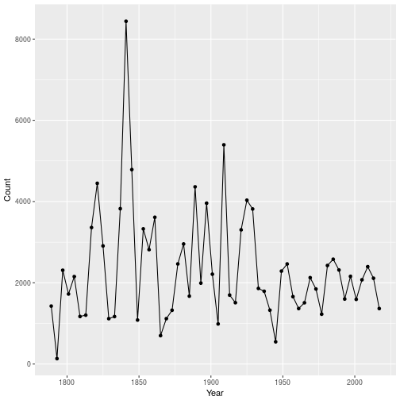
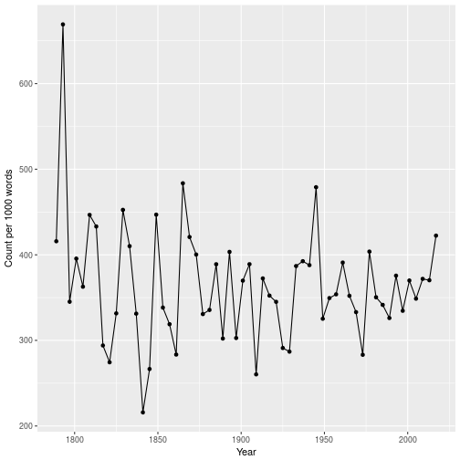
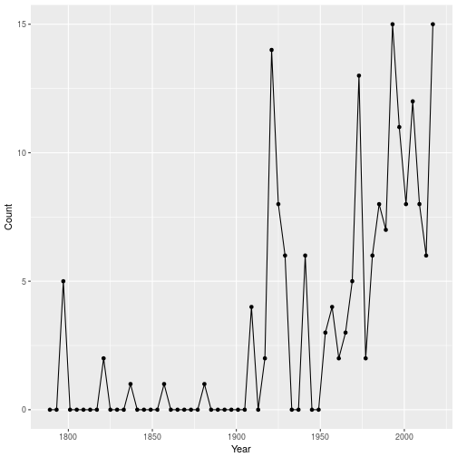
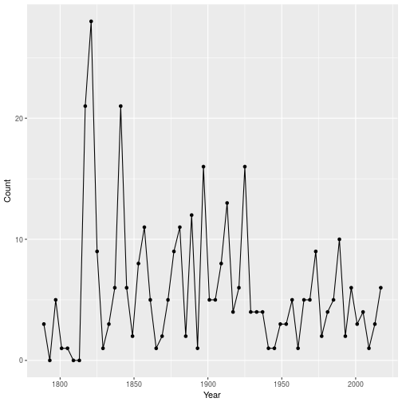
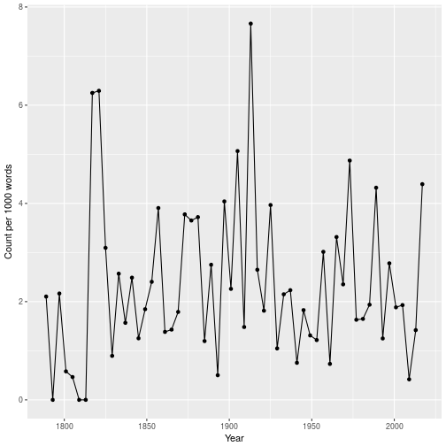

Earlier this week, on January 20th 2017, Donald J. Trump was inaugurated as the 45th president of the USA. He also gave what seemed like a very short inaugural address, and so I was curious to see how short it really was compared to previous addresses. It was also an opportunity to have a quick look at other properties of his speech. 

<!--more-->

## Data extraction

The data was extracted from the website of [The American Presidency Project](https://www.presidency.ucsb.edu/) at the University of California--Santa Barbara. They have lots of interesting information, and in particular they have the transcripts of **all** [inaugural addresses](https://www.presidency.ucsb.edu/inaugurals.php) ever delivered. So using Chrome's developper tools, I found a quick and dirty way of extracting the text from all these speeches. I'm using the [`rvest` package](https://cran.r-project.org/package=rvest). Also, I'm indexing each speech by the year of its corresponding inauguration.


```r
library(rvest)
library(magrittr)
library(dplyr)
webpage <- "http://www.presidency.ucsb.edu/inaugurals.php"

years <- read_html(webpage) %>%
  html_nodes("table.ver11 a") %>% 
  html_text() %>%
  substr(start = nchar(.) - 3, stop = nchar(.)) %>%
  as.numeric 

urls <- read_html(webpage) %>%
  html_nodes("table.ver11 a") %>% 
  html_attr("href")

address_data <- data.frame("Year" = years,
                           "URL" = urls)

# Scrape text----
# Recall that dplyr::mutate needs a window function
extract_text <- function(url_vect) {
  sapply(seq_along(url_vect), function(i) {
    read_html(urls[i]) %>% 
      html_node(".displaytext") %>% 
      html_text()
  })
}
address_data %<>% mutate("Text" = extract_text(URL))
```

Now we will look at the frequency of certain words, so we need to parse the text and extract individual words. Fortunately, this can easily be done with Julia Silge and Dave Robinson's [`tidytext`](https://cran.r-project.org/package=tidytext) package. The main advantage of their package is that we stay within the [tidyverse](https://blog.rstudio.org/2016/09/15/tidyverse-1-0-0/), and therefore we can easily use packages like `dplyr` and `ggplot2` with the output.


```r
library(tidytext)
# Tokenize each text
address_tokenized <- address_data %>% 
  unnest_tokens(Token, Text)
```

We will be using `address_tokenized` for the rest of the analysis.

## Was it really short?

First, we will look at the raw count of words, which should give us an idea of the length of the address itself.


```r
library(ggplot2)
# Plot word count per year
address_tokenized %>% 
  group_by(Year) %>%
  summarise(Count = n()) %>%
  ggplot(aes(Year, Count)) + geom_point() + geom_line()
```



Indeed, Trump's address was on the short side; in fact, in was the shortest since [Carter's address](http://www.presidency.ucsb.edu/ws/index.php?pid=6575). But is was only the 15th shortest address, essentially as long as Kennedy's famous address (["ask not what your country can do for you--ask what you can do for your country"](http://www.presidency.ucsb.edu/ws/index.php?pid=8032)). 

(For those who are interested: the shortest speech is [Washington's second address](http://www.presidency.ucsb.edu/ws/index.php?pid=25801), and the longest was by POTUS number 9, [William Henry Harrison](http://www.presidency.ucsb.edu/ws/index.php?pid=25813). Famously, Harrison died 31 days later due to complications from pneumonia.)

Another interesting way of looking at this data is to look at how many *unique* words there are for every 1000 words (to adjust for the length of the speech itself). This can perhaps be construed as a measure of the vocabulary size of each President. A more accurate [estimate of the vocabulary size](https://academic.oup.com/biomet/article-abstract/63/3/435/270845/Estimating-the-number-of-unseen-species-How-many) of a person is possible, but it typically requires a much larger corpus than what inaugural addresses can offer.


```r
unique_count <- address_tokenized %>% 
  group_by(Year) %>%
  count(Token) %>%
  summarise(Count = n())

total_count <- address_tokenized %>% 
  group_by(Year) %>%
  summarise(Total = n())

inner_join(unique_count, total_count) %>%
  ggplot(aes(Year, 1000 * Count/Total)) + 
    geom_point() + geom_line() + ylab("Count per 1000 words")
```



Using this (very rough) metric, it would appear that Trump showed a broader choice of vocabulary than any President since [FDR's fourth inaugural address](http://www.presidency.ucsb.edu/ws/index.php?pid=16607) in 1945. Note that that largest value, from Washington's second inaugural address, is misleading, since his speech was only 133 words long.

## Make America Great Again

You've heard it, you've read it, perhaps you've loathed it or instead [lurved it](https://youtu.be/B-Ir153t7Eg): Trump's campaign slogan. We have heard so many times, in fact, that I was wondering if the words "Great" and "America" appeared more often in Trump's address than any other. The results, some surprising, appear below.

### America

Let's start with the word "America":


```r
address_tokenized %>% 
  group_by(Year) %>%
  count(Token, wt = (Token == "america")) %>%
  summarise(Count = sum(n)) %>%
  ggplot(aes(Year, Count)) + geom_point() + geom_line()
```



There is an interesting trend over time. John Adams was the first president to use the word "America" in his [inaugural address](http://www.presidency.ucsb.edu/ws/index.php?pid=25802). And the first president to say it more than five times was Harding. But Trump has definitely said it multiple times, 15 in fact, the most of any president except Clinton in his [1993 inaugural address](http://www.presidency.ucsb.edu/ws/index.php?pid=46366). But given that Clinton's address was slightly longer, we can probably agree that Trump takes this round.

Another surprisi[ng fact: it would be unimaginable today to hear *any* presidential speech that doesn't conclude with some variation on "God bless America". Still, before Eisenhower's [first inaugural address](http://www.presidency.ucsb.edu/ws/index.php?pid=9600), 30 out of 41 addresses did not contain the word "America"; since then, it has always appeared at least twice. 

### Great

Now let's look at the word "Great":


```r
address_tokenized %>% 
  group_by(Year) %>%
  count(Token, wt = (Token == "great")) %>%
  summarise(Count = sum(n)) %>%
  ggplot(aes(Year, Count)) + geom_point() + geom_line()
```



So in fact, Trump is not the president who has uttered the word "great" the most! This honour goes to Monroe, on the [last inaugural address](http://www.presidency.ucsb.edu/ws/index.php?pid=25808) of the [Era of Good Feelings](https://en.wikipedia.org/wiki/Era_of_Good_Feelings). But Monroe's address was more than three times longer than Trump's, so to get a clearer picture, let's look at one many times per 1000 words the word "great" appears in each inaugural address. 


```r
great_count <- address_tokenized %>% 
  group_by(Year) %>%
  count(Token, wt = (Token == "great")) %>%
  summarise(Count = sum(n)) 

total_count <- address_tokenized %>% 
  group_by(Year) %>%
  summarise(Total = n())

inner_join(great_count, total_count) %>%
  ggplot(aes(Year, 1000 * Count/Total)) + 
    geom_point() + geom_line() + ylab("Count per 1000 words")
```



Therefore, after adjusting for total word count, Trump is still not the at the top. But now, instead of Monroe, we find Wilson's [1913 inaugural address](http://www.presidency.ucsb.edu/ws/index.php?pid=25831). 

## Conclusion

After looking at all this, we get a sense that, even though Trump's speech was on the short side, it was far from the shortest overall. Moreover, we saw that Trump used the word America more than any President before him (I will let you draw your own conclusions), but the word Great appears quite frequently in inaugural addresses, and Trump's had only the sixth highest frequency (after adjusting for the length of the speech).

All the analyses above don't really address the meaning of Trump's inauguration in the grand scheme of things, and nor was it the goal. For those interested, you can look at [annotated](https://www.nytimes.com/interactive/2017/01/20/us/politics/donald-trump-inauguration-speech-transcript.html?_r=0) [transcripts](http://www.npr.org/2017/01/20/510629447/watch-live-president-trumps-inauguration-ceremony) of his [inaugural](https://www.theguardian.com/us-news/ng-interactive/2016/nov/09/president-victory-speech-annotated) [address](https://www.washingtonpost.com/news/the-fix/wp/2017/01/20/donald-trumps-full-inauguration-speech-transcript-annotated/).

As a follow-up analysis, it would be interesting to do a cluster analysis of the inaugural addresses, in order to see which Presidents had similar addresses. But this will have to wait for another post.
