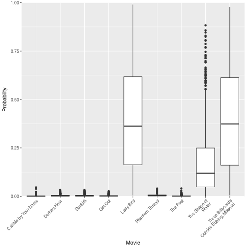
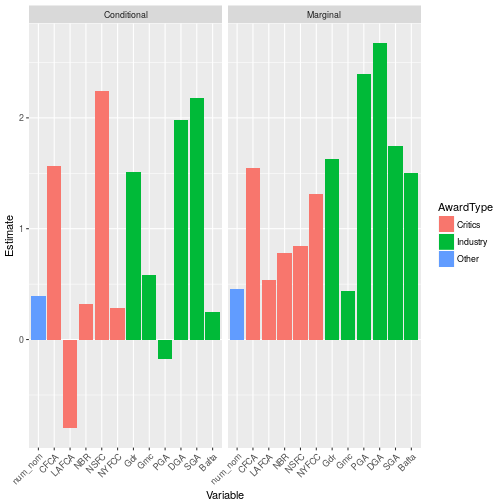

A few years ago, as part of the graduate course *Data Analysis and Report Writing* in the Department of Epidemiology, Biostatistics and Occupational Health at McGill University, we explored the topic of predictive modeling using a dataset containing movies, directors and actors who were nominated for an Academy Award. The goal was to select some variables and build a predictive model for the winner in four categories: Best Picture, Best Director, Best Actor, and Best Actress. As a movie fan, this was the dream assignment: I could combine my love of movies with my love of statistics! And it payed off: I was the only one in my class to correctly predict all four winners.

<!--more-->

Over the years, I've continued using the model, but I've also tweaked it a bit. In this post, I want to describe my model and present the predictions for this year (see my full predictions [here](https://www.maxturgeon.ca/blog/2018-02-24-oscar-predictions-2018/)). 

## Conditional logistic regression

The modeling method I've selected is *conditional logistic regression*. I will give more details about how it works, but at the main principle is as follows: **we condition on the number of events (i.e. winners) per strata**. As we will see, this principle leads to many desirable characteristics that make this an ideal tool for this situation:

  - We get a set of predictions that add up to 1. In particular, we will never get two nominees with probabilities above 50%.
  - When all observations in a stratum have the same value for a given covariate, the contribution of this stratum to the estimation of the coefficient corresponding to this covariate simply drops from the likelihood. As a consequence, there is absolutely no problem in using the results from the Golden Globes (the first ceremony was in 1944) and those from the Screen Actors Guild Awards (the first ceremony was in 1995) in the same model.
  - We can model a different baseline probability (i.e. a different intercept) for each stratum, without using any degree of freedom.
  
### A little bit of probability calculus

Let \\( Y_1,\\ldots,Y_K \\) be the winning indicator for each nominee in a given category on a given year. If we assume that only one candidate can win, i.e. if we condition on \\( \\sum Y_j = 1 \\), the probability that the i-th nominee wins is
\\[ P(Y_i = 1 \\mid \\sum Y_j = 1) = \\frac{P(Y_i = 1)}{\\sum P(Y_j = 1)}. \\]
If we model the (unconditional) probabilities using a log link and a linear predictor, we get
\\[ P(Y_i = 1 \\mid \\sum Y_j = 1) = \\frac{\\exp(\\beta X_i)}{\\sum \\exp(\\beta X_j)}. \\]
We then get the likelihood by multiplying these individual contributions over nominees and over strata (i.e. individual ceremonies). From these two equations, we can derive the three properties above: first, we clearly have
\\[ \\sum P(Y_i = 1 \\mid \\sum Y_j = 1) = 1. \\]
Second, if all nominees have the same value for a given predictor, then we can factor it from the numerator and the denominator, and hence cancel it out. Finally, the intercept is one such predictor that is common to all nominees, and so it cancels out. In particular, the intercept could be different for each stratum--it is actually non-identifiable, so we can't test if that is indeed the case.

## Choosing the predictors

It is helpful to remember the following: we are **not** trying to describe the data-generating mechanism that leads to a movie winning an Oscar; we are simply trying to mimic it as closely as possible. The distinction is important: in the former case, there are simply too many variables in play and not enough data to estimate all important contributing factors; in the latter case, we can use the precursor awards. And conceptually, this also makes a lot of sense: the Academy is composed of roughly 7000 members who also vote for other industry awards during the season. 

Keeping all this in mind, the predictors I used are the winners of several critics awards (Chicago Film Critics Association, Los Angeles Film Critics Association, National Board of Review, National Society of Film Critics, and the New York Film Critics Circle), several industry awards (British Academy of Film and Television Arts, Screen Actors Guild, Producers Guild of America, and Directors Guild of America), as well as the results from the Golden Globes. There is one exception: for Best Picture, I also use the number of Academy Award nominations.

Finally, we should also keep in mind the following rule-of-thumb: you should have around 5-10 events per predictor in order to get a stable model, i.e. control for over-fitting.

## Collecting the data

Starting this year, I've decided to scrape the web to collect the data. Of course, web scrapers are by definition non-robust, and therefore I may have to make major changes in the future. But I like the flexibility it provides me, since I can easily add other awards. But this also means I had to do **a lot** of data cleaning. For those of you who are interested, I encourage you to look at my Github repo: (github.com/turgeonmaxime/oscar-db).

## Predicting Best Picture

We are finally ready to make some predictions! I've put together a dataset that contains all the information we need (again, look at my [Github repo](github.com/turgeonmaxime/oscar-db) for the code):


```r
library(tidyverse)
library(magrittr)

names(data_bestpic)
```

```
##  [1] "Year"     "Ceremony" "Award"    "Winner"   "Name"     "Film"    
##  [7] "num_nom"  "Gdr"      "Gmc"      "Bafta"    "PGA"      "DGA"     
## [13] "SGA"      "CFCA"     "LAFCA"    "NBR"      "NSFC"     "NYFCC"
```

```r
data_bestpic %>% 
    filter(Year == 2016)
```

```
## # A tibble: 9 x 18
##    Year Ceremony        Award Winner                  Name
##   <chr>    <dbl>        <chr>  <dbl>                 <chr>
## 1  2016       89 Best Picture      1             Moonlight
## 2  2016       89 Best Picture      0               Arrival
## 3  2016       89 Best Picture      0                Fences
## 4  2016       89 Best Picture      0         Hacksaw Ridge
## 5  2016       89 Best Picture      0    Hell or High Water
## 6  2016       89 Best Picture      0        Hidden Figures
## 7  2016       89 Best Picture      0            La La Land
## 8  2016       89 Best Picture      0                  Lion
## 9  2016       89 Best Picture      0 Manchester by the Sea
## # ... with 13 more variables: Film <chr>, num_nom <int>, Gdr <dbl>,
## #   Gmc <dbl>, Bafta <dbl>, PGA <dbl>, DGA <dbl>, SGA <dbl>, CFCA <dbl>,
## #   LAFCA <dbl>, NBR <dbl>, NSFC <dbl>, NYFCC <dbl>
```


We will use the `survival` package to fit a conditional logistic regression model:

```r
library(survival)
pred_pic <- c("num_nom", "Gdr", "Gmc", "Bafta", "PGA", "DGA",
              "SGA", "CFCA", "LAFCA", "NBR", "NSFC", "NYFCC")

fit_pic <- clogit(formula(paste("Winner ~", paste(pred_pic, collapse = "+"), 
                                "+ strata(Year)")),
                  data = filter(data_bestpic, Winner != -1))
```

All current nominees are identified using `Winner == -1`. We can look at the summary of this model:

```r
summary(fit_pic)
```

```
## Call:
## coxph(formula = Surv(rep(1, 435L), Winner) ~ num_nom + Gdr + 
##     Gmc + Bafta + PGA + DGA + SGA + CFCA + LAFCA + NBR + NSFC + 
##     NYFCC + strata(Year), data = filter(data_bestpic, Winner != 
##     -1), method = "exact")
## 
##   n= 435, number of events= 78 
## 
##             coef exp(coef) se(coef)      z Pr(>|z|)    
## num_nom  0.39531   1.48484  0.09736  4.060 4.90e-05 ***
## Gdr      1.51457   4.54745  0.56314  2.689  0.00716 ** 
## Gmc      0.58223   1.79003  0.70220  0.829  0.40702    
## Bafta    0.25220   1.28685  0.68237  0.370  0.71169    
## PGA     -0.17996   0.83530  0.76309 -0.236  0.81356    
## DGA      1.98418   7.27306  0.39928  4.969 6.72e-07 ***
## SGA      2.17629   8.81352  0.81292  2.677  0.00743 ** 
## CFCA     1.56838   4.79888  0.77942  2.012  0.04419 *  
## LAFCA   -0.80066   0.44903  0.72926 -1.098  0.27225    
## NBR      0.32401   1.38266  0.50704  0.639  0.52281    
## NSFC     2.24504   9.44077  0.75837  2.960  0.00307 ** 
## NYFCC    0.28481   1.32951  0.41083  0.693  0.48815    
## ---
## Signif. codes:  0 '***' 0.001 '**' 0.01 '*' 0.05 '.' 0.1 ' ' 1
## 
##         exp(coef) exp(-coef) lower .95 upper .95
## num_nom    1.4848     0.6735    1.2269     1.797
## Gdr        4.5474     0.2199    1.5081    13.712
## Gmc        1.7900     0.5586    0.4520     7.089
## Bafta      1.2868     0.7771    0.3378     4.902
## PGA        0.8353     1.1972    0.1872     3.727
## DGA        7.2731     0.1375    3.3255    15.907
## SGA        8.8135     0.1135    1.7914    43.362
## CFCA       4.7989     0.2084    1.0416    22.110
## LAFCA      0.4490     2.2270    0.1075     1.875
## NBR        1.3827     0.7232    0.5118     3.735
## NSFC       9.4408     0.1059    2.1354    41.738
## NYFCC      1.3295     0.7522    0.5943     2.974
## 
## Rsquare= 0.294   (max possible= 0.454 )
## Likelihood ratio test= 151.5  on 12 df,   p=0
## Wald test            = 56.58  on 12 df,   p=9.413e-08
## Score (logrank) test = 170.7  on 12 df,   p=0
```

(**Note**: we can actually show that the conditional logistic likelihood has a similar form to a Cox regression partial likelihood. The `survival` package uses this trick to fit the likelihood, and this is why we get a call to `coxph`.)

As we can see from the summary, the largest odds ratios are those for the Screen Actors Guild Awards (*Best Performance by an Ensemble Cast*) and the National Society of Film Critics. But we can also see that some of these confidence intervals are *huge*! This is clearly a consequence of the fact that we only have 78 events...

Now, let's make predictions for this year:

```r
# Extract coefficients
coef_pic <- summary(fit_pic)$coefficients[,1]
# Look at this year's data
current_pic <- data_bestpic %>% 
    filter(Winner == -1)
# We get the predictions using a bit of matrix multiplication
exp_pic <- exp(as.matrix(current_pic[, colnames(current_pic) %in% pred_pic]) %*% coef_pic)
predict_pic <- exp_pic/sum(exp_pic)
# Add the movie names
rownames(predict_pic) <- current_pic$Name
predict_pic
```

```
##                                                  [,1]
## Call Me by Your Name                      0.001118943
## Darkest Hour                              0.003700077
## Dunkirk                                   0.003700077
## Get Out                                   0.002491896
## Lady Bird                                 0.398941783
## Phantom Thread                            0.005494039
## The Post                                  0.001562732
## The Shape of Water                        0.162246700
## Three Billboards Outside Ebbing, Missouri 0.420743752
```

```r
# For more clarity
round(100 * predict_pic)
```

```
##                                           [,1]
## Call Me by Your Name                         0
## Darkest Hour                                 0
## Dunkirk                                      0
## Get Out                                      0
## Lady Bird                                   40
## Phantom Thread                               1
## The Post                                     0
## The Shape of Water                          16
## Three Billboards Outside Ebbing, Missouri   42
```

If you follow the Oscar race, this may seems a bit surprising: as of February 25th, *The Shape of Water* is considered a front-runner, and yet the model only assigned about 16% chance of winning. Looking at the estimates of the regression coefficients, it is obvious why: *Three Billboards Outside Ebbing, Missouri* won the SAG award, *Lady Bird* won most of the critics awards, but *The Shape of Water* only won the DGA award and the PGA award. And the latter actually has a *negative* coefficient, meaning that a win at the PGA actually *decreases* the odds of winning an oscar (all other things held equal)...

Let's try to get a sense of the variability in these predictions. For this, we will use *parametric bootstrap*: since the conditional logistic likelihood satisfies the usual properties, the estimator for the regression coefficients has an approximate multivariate normal distribution. Since we also estimated its covariance matrix, we can actually sample for the distribution, get new point estimates of the coefficients, and recompute the winning probabilities.


```r
n.boot <- 10000
cov_pic <- fit_pic$var
# Sample from the estimator distribution
samples_pic <- MASS::mvrnorm(n = n.boot, mu = coef_pic, Sigma = cov_pic)
# Recompute the winning probabilities
boot_prob_pic <- purrr::map_df(seq_len(n.boot), function(row){
    pred_log <- as.matrix(current_pic[, colnames(current_pic) %in% pred_pic]) %*% samples_pic[row,] %>% 
        exp %>% 
        t
    colnames(pred_log) <- current_pic$Name
    pred <- pred_log/sum(pred_log)
    mode(pred) <- "list"
    return(as.data.frame(pred))
}) %>% mutate_all(as.numeric)
```

Each row in `boot_prob_pic` corresponds to a new point estimate of the winning probabilities (I had to do some munging to make sure I get the right `data.frame`). From this we can look at the distribution of winning probabilities:

```r
boot_prob_pic %>% 
    sample_n(1000) %>% # Take a random sample
    rename(`The Shape of\nWater` = `The Shape of Water`,
           `Three Billboards\nOutside Ebbing, Missouri` = `Three Billboards Outside Ebbing, Missouri`) %>% # Add line breaks for plotting
    gather(Movie, pred) %>% 
    ggplot(aes(y = pred, x = Movie)) + geom_boxplot() + 
    ylab("Probability") + expand_limits(y = 0) +
    scale_y_continuous(lim = c(0, 1), expand = c(0, 0)) +
    theme(axis.text.x = element_text(angle = 45, hjust = 1))
```



As we can see, there is a lot of variation in these predictions, and therefore *The Shape of Water* winning is not incompatible with our model fit. 

One more thing to keep in mind: people are generally bad with probabilities, and even worse with *conditional* probabilities. As a consequence, it may be the case that pundits are overestimating *The Shape of Water*'s chances because they have trouble combining the information from all sources and giving them the proper weight. As an illustration of this, let's compare the conditional estimates (i.e. the ones we got from the model) to marginal estimates (i.e. that we would get by fitting only one covariate at a time):

```r
# Window function to get marginal coefficients
marg_coef <- function(pred) {
    sapply(seq_along(pred), function(i)
        clogit(formula(paste("Winner ~", pred[i], "+ strata(Year)")),
               data = filter(data_bestpic, Winner != -1)) %>% 
            coef
    )
    }

# Order the predictors
levels_pred <- c("num_nom", "CFCA", "LAFCA", "NBR", "NSFC", "NYFCC", 
                 "Gdr", "Gmc", "PGA", "DGA", "SGA", "Bafta")

fit_pic %>% 
    coef() %>% 
    data.frame(Conditional = .) %>% 
    mutate(Variable = factor(row.names(.), 
                             levels = levels_pred),
           Marginal = marg_coef(Variable),
           AwardType = case_when(
               Variable %in% c("CFCA", "LAFCA", "NBR", "NSFC", "NYFCC") ~ "Critics",
               Variable %in% c("Gdr", "Gmc", "PGA", "DGA", "SGA", "Bafta") ~ "Industry",
               TRUE ~ "Other"
           )) %>% 
    gather(Type, Estimate, Conditional, Marginal) %>% 
    ggplot(aes(x = Variable, y = Estimate, fill = AwardType)) + 
    geom_col() + facet_grid(.~Type) +
    theme(axis.text.x = element_text(angle = 45, hjust = 1))
```

```
## Warning: attributes are not identical across measure variables;
## they will be dropped
```



As we can see, although on its own the PGA Award winner seems a good predictor (since 1989, the Academy Award and the PGA Award went to the same movie 19 times out of 28), once we include the information coming from the other guild awards it loses its predictive ability. Therefore, given that *The Shape of Water* only won the PGA and DGA awards, I believe *Three Billboards Outside Ebbing, Missouri* is the real front-runner.
